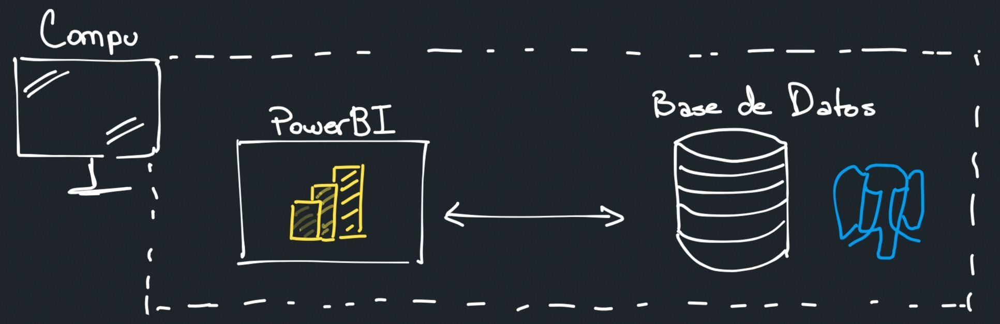
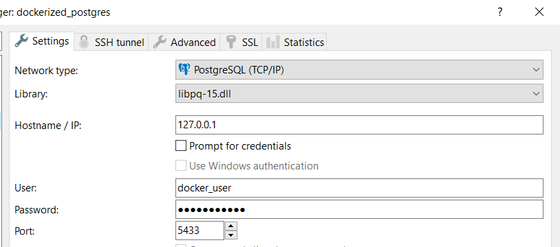
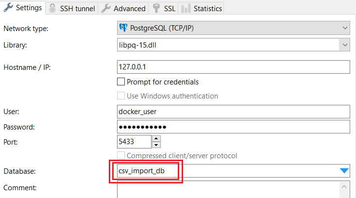
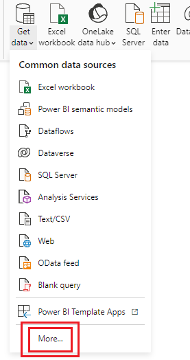
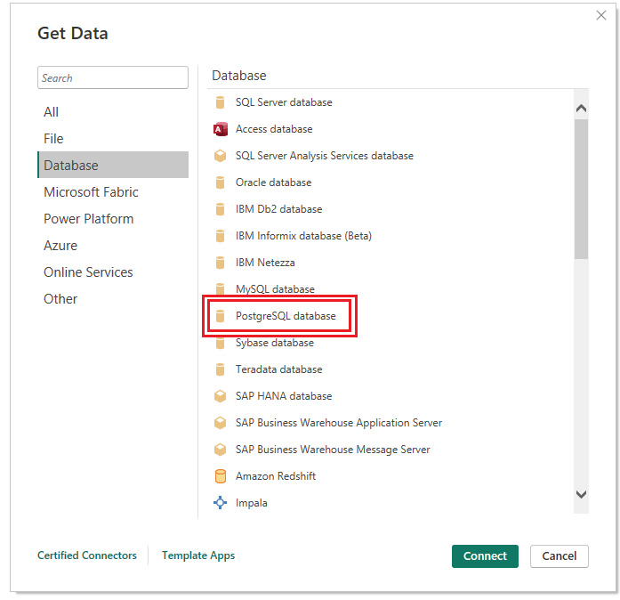
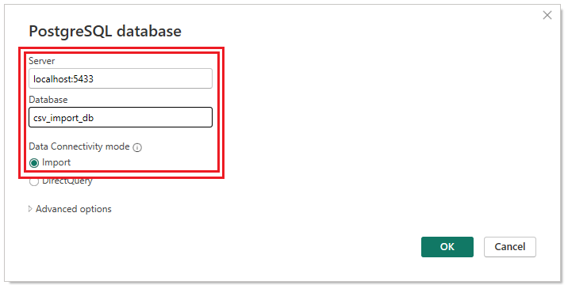

# tp-ayid-grupo-1
> Repositorio para info relacionada al TP de Análisis de la la Información y la Decisión - Grupo 1

La solución final, además de incluir la presentación, debe mostrar:
1. **Una instancia de PowerBI** funcional conectada a una base de datos.
2. **Una base de datos** a la que PowerBI se conecte.



## 🔽 Instalación y herramientas de trabajo local
Para cumplir con los requerimientos de la evaluación esta instancia debe tener una conexión activa con el servidor de base de datos que alimenta al modelo.

### Pasos para trabajar con PowerBI x Excel localmente (**Recomendado para trabajo normal**)
1. Instalar PowerBI.
    1. Si tienen Windows puede ser a través de la Microsoft Store (instalada en Windows) o con el instalador descargada de la página oficial de Microsoft.
    2. Si tienen Mac a través del instalador descargándolo de la página oficial  Microsoft.
2. Importar dataset a PowerBI.
    1. Opción 1: para trabajar ligeramente (sin instalar nada más) se puede importar directamente desde los `.csv` | `.xlsx` presentes en este repo en `.\dataset\tabla_*` como lo vimos en clases (**TODAVÍA NO ESTÁN CARGADOS**).
    2. Opción 2: para trabajar con una BB. DD. seguir los pasos de la siguiente sección.

### Pasos para trabajar con PowerBI x BB. DD. (**Lo que es necesario hacer para mostrar en la presentación**)
**Yo elegí usar PostgreSQL como servidor de base de datos**. Esto lo decidí porque: 
- Es gratis, para nuestra escala es indiferente los problemas que te resuelve estar con una .
- Tiene mucha documentación y comunidad disponible en internet.
- Lo podemos cambiar, no es difícil.

Por otro lado decidí correr el servidor de BB. DD. a través de Docker, una herrmienta que utiliza contenedores para ejecutar código de forma local, aislada y portátil. Esto fue recomendado por el profe Bernardo. Esta sección explica cómo hacer este procedimiento y preparar la BB. DD. para PowerBI

#### Opción A - BB. DD. volatil usando Docker
1. Instalar Docker, aquí el link a la documentación oficial: [Install Docker Desktop on Windows](https://docs.docker.com/desktop/install/windows-install/).
    
2. Una vez esté listo el setup de Docker y esté corriendo, levantamos PostgreSQL trayendo la imagen. Para hacer eso: 

```bash
docker pull postgres
```
3. Levantamos la instancia de PostgreSQL a través de Docker, les recomiendo que singan este [tutorial](https://medium.com/@basit26374/how-to-run-postgresql-in-docker-container-with-volume-bound-c141f94e4c5a) presente en las referencias en esta sección. Deberíamos poer correr el siguiente comando y obtener un resultado:

```bash
docker run --name bd_postgres_tp -e POSTGRES_PASSWORD=docker_user -e POSTGRES_USER=docker_user -p 5433:5432 -d postgres
# Debería ser un resultado como:
# 8221968a3a1fe2050b608281db83219411636aec469e44f5e0a32a3aebd74cdf
```

> 💡 A partir de ahora tenemos una BB.DD. PostgreSQL localmente que puede ser accesible desde el puerto 5433 de nuestra máquina. 

4.  Cualquier cliente (visualizador) de BB.DD. preparado para conectarse con un servidor PostgreSQL que tengan les debería permitir acceder a la misma, yo usé HeidiSQL (lo pueden instalar a su máquina [desde aquí](https://www.heidisql.com/download.php)) y manipularla con el usuario "docker_user" y la contraseña "docker_user" (las definimos cuando corrimos la instancia de Docker).
    1. Para operar correctamente debemos conectarnos a la BB. DD. por default que nos expone PostgreSQL, debemos hacerlo carganos la info más o menos así:
    
    2. Luego creamos una BB. DD. para trabajar ejecutando (o creando a través de la interfaz de usuario) **otra** BB. DD. con un nombre como "csv_import_db".
    3. Ahora nos **desconectamos** de la conexión que teníamos para hacerlo directmente sobre la BB. DD. creada. Dejo otro ejemplo de cómo queda (usuario y contraseña quedan iguales):
    
    

5. Ahora sí, importamos los datos desde excel con la herramienta de importación de CSV provista por HeidiSQL, se puede encontrar en la parte superior de la app en la solapa "Herramientas". Les dejo unos comentarios sobre cómo lograrlo:
    * Por cada tabla en el modelo estrella hacer una importación diferente (una por cada archivo CSV).

6. Una vez estén cargados los datos, ahora sí podemos importarlos desde PowerBI a través de la herramienta de importación de datos. A continuación les dejo un paso a paso para configurar correctamente la importación.

> ⚠ **IMPORTANTE:** el servidor de BB. DD. debe seguir corriendo para que se pueda conectar correctamente. 







> **✅ Ahora debería estar todo listo para trabajar.** 

#### Referencias
Me basé en este tutorial para implementar esta infrastructura: [Running PostgreSQL in Docker Container with Volume](https://medium.com/@basit26374/how-to-run-postgresql-in-docker-container-with-volume-bound-c141f94e4c5a).
